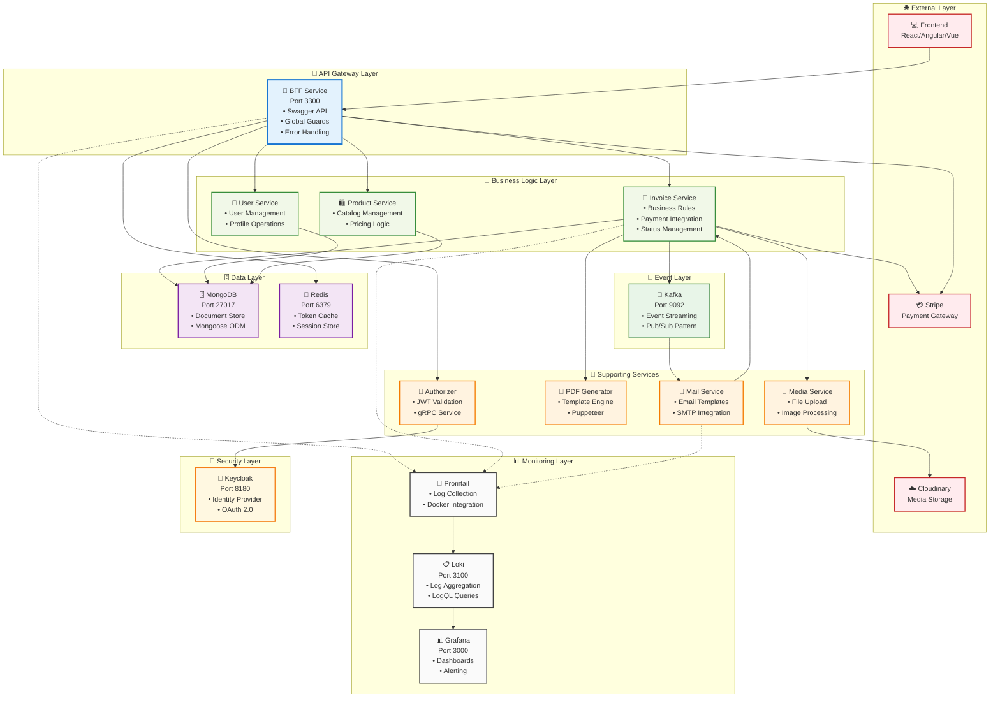
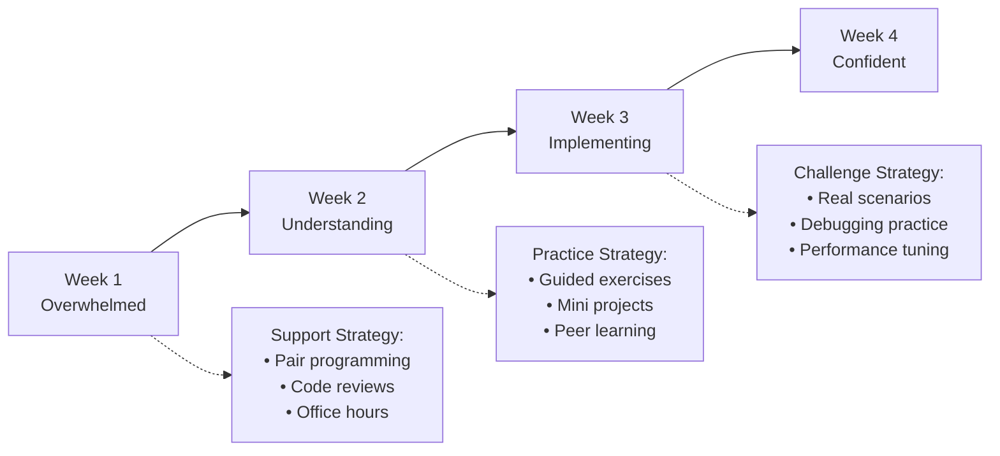
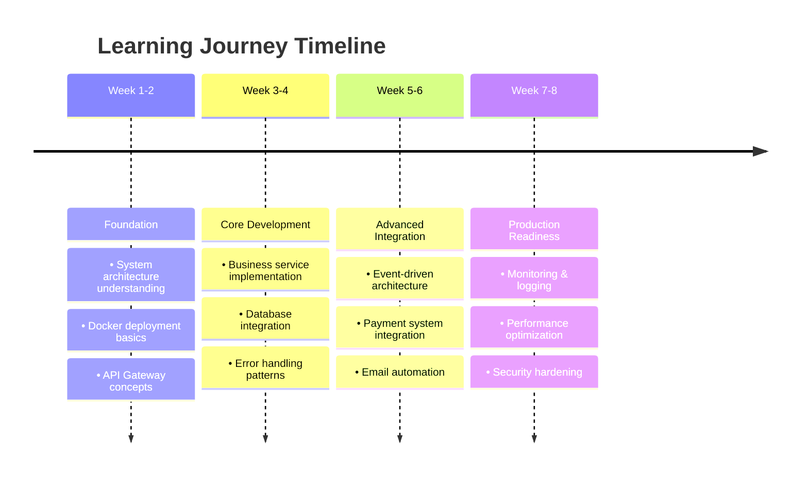

# 👨‍🏫 Instructor's Complete Teaching Guide

## 🎯 Executive Summary

This repository contains a **production-grade E-Invoice microservices system** built with **NestJS**, featuring **8 microservices**, **6 infrastructure services**, and **enterprise-level integrations**. Perfect for teaching **real-world microservices architecture**.

### 🏆 What Makes This Special
| Feature | Implementation | Teaching Value |
|---------|----------------|----------------|
| **8 Microservices** | Complete business domain separation | Service design patterns |
| **Production Monitoring** | Grafana + Loki + Promtail stack | Observability best practices |
| **Payment Integration** | Full Stripe checkout + webhooks | Real business integration |
| **Enterprise Auth** | Keycloak + Redis caching | Security architecture |
| **Event-Driven** | Kafka with custom decorators | Async communication patterns |
| **Docker Deployment** | Multi-service orchestration | DevOps practices |

### 🎓 Perfect Teaching Case Study For:
- ✅ **Microservices Design Patterns** - API Gateway, Event Sourcing, CQRS
- ✅ **Enterprise Integration** - Payment systems, authentication, monitoring
- ✅ **Production Deployment** - Docker, logging, error handling
- ✅ **Performance Optimization** - Redis caching, connection pooling
- ✅ **Event-Driven Architecture** - Kafka producers/consumers
- ✅ **Security Implementation** - JWT tokens, webhook verification
- ✅ **Business Logic Modeling** - Invoice lifecycle, payment flow
- ✅ **Modern DevOps** - Container orchestration, centralized logging

---

## 🏗️ System Architecture (Production-Ready)

### 📊 Complete System Overview


### 🔄 Communication Patterns Matrix
| Pattern | Services | Protocol | Use Case | Performance | Complexity |
|---------|----------|----------|----------|-------------|------------|
| **HTTP REST** | Frontend ↔ BFF | HTTP/1.1 | External API | ⭐⭐⭐ | ⭐ |
| **TCP RPC** | BFF ↔ Business Services | TCP | Internal sync | ⭐⭐⭐⭐ | ⭐⭐ |
| **gRPC** | BFF ↔ Authorizer | HTTP/2 | Authentication | ⭐⭐⭐⭐⭐ | ⭐⭐⭐ |
| **Kafka Events** | Invoice → Mail | TCP | Async processing | ⭐⭐⭐⭐⭐ | ⭐⭐⭐⭐ |
| **Redis Cache** | Guards ↔ Redis | TCP | Token caching | ⭐⭐⭐⭐⭐ | ⭐⭐ |
| **Webhooks** | Stripe → BFF | HTTP | Payment events | ⭐⭐⭐⭐ | ⭐⭐⭐ |

---

## 🎯 Comprehensive Course Structure (56 Hours)

### 📚 **Module 1: Architecture Fundamentals** (8 hours)
#### Session 1-2: System Design Deep Dive
| Topic | Duration | Content | Hands-on |
|-------|----------|---------|----------|
| **Microservices vs Monolith** | 2h | Trade-offs, when to use each | Architecture comparison |
| **System Overview** | 2h | 8 services + 6 infrastructure | Complete system walkthrough |
| **Communication Patterns** | 2h | TCP, gRPC, Kafka, HTTP | Protocol analysis |
| **Docker Architecture** | 2h | Multi-service deployment | Full system startup |

**🎯 Learning Goals**: Understand complete system architecture and deployment

---

### 🚪 **Module 2: API Gateway & BFF** (8 hours)  
#### Session 3-4: Gateway Patterns & Implementation
| Topic | Duration | Content | Hands-on |
|-------|----------|---------|----------|
| **BFF Pattern** | 2h | Backend for Frontend concept | Code walkthrough |
| **NestJS Advanced** | 2h | Guards, Interceptors, Middleware | Custom implementations |
| **Swagger Integration** | 2h | API documentation best practices | Interactive API testing |
| **Authentication Flow** | 2h | JWT + Redis caching strategy | Token management |

**🎯 Learning Goals**: Master API Gateway patterns and NestJS advanced features

---

### 💼 **Module 3: Core Business Services** (12 hours)
#### Session 5-7: Business Logic & Data Management
| Topic | Duration | Content | Hands-on |
|-------|----------|---------|----------|
| **Invoice Service** | 3h | Business logic, status management | CRUD operations |
| **Repository Pattern** | 2h | Data access layer design | Database operations |
| **MongoDB Integration** | 2h | Schema design, Mongoose ODM | Database modeling |
| **User & Product Services** | 3h | Service implementation patterns | Multi-service coordination |
| **Validation & Error Handling** | 2h | DTO validation, global error handling | Error scenarios |

**🎯 Learning Goals**: Implement robust business logic with proper data management

---

### 🔄 **Module 4: Event-Driven Architecture** (8 hours)
#### Session 8-9: Async Communication & Events
| Topic | Duration | Content | Hands-on |
|-------|----------|---------|----------|
| **Kafka Setup** | 2h | Broker configuration, topics | Event infrastructure |
| **Producer/Consumer** | 2h | Custom decorators, event handling | Event implementation |
| **Mail Service** | 2h | Email processing, templates | Email automation |
| **Event Patterns** | 2h | Event sourcing, CQRS concepts | Event-driven design |

**🎯 Learning Goals**: Master asynchronous communication and event-driven patterns

---

### 💳 **Module 5: Payment Integration** (8 hours)
#### Session 10-11: Real-World Payment Processing  
| Topic | Duration | Content | Hands-on |
|-------|----------|---------|----------|
| **Stripe Integration** | 3h | Checkout sessions, payment links | Payment setup |
| **Webhook Processing** | 2h | Signature verification, event handling | Webhook implementation |
| **Payment Flow** | 2h | Status management, business logic | Complete payment cycle |
| **Email Templates** | 1h | Dynamic content, payment links | Professional emails |

**🎯 Learning Goals**: Implement secure, production-ready payment processing

---

### 🏗️ **Module 6: Infrastructure & DevOps** (8 hours)
#### Session 12-13: Production Deployment & Monitoring
| Topic | Duration | Content | Hands-on |
|-------|----------|---------|----------|
| **Nx Monorepo** | 2h | Shared libraries, build optimization | Code organization |
| **Docker Deployment** | 2h | Multi-service orchestration | Production deployment |
| **Monitoring Stack** | 3h | Grafana + Loki + Promtail | Observability setup |
| **Performance Optimization** | 1h | Redis caching, connection pooling | Performance tuning |

**🎯 Learning Goals**: Deploy and monitor production-ready microservices

---

### 🚀 **Module 7: Advanced Topics** (4 hours)
#### Session 14: Enterprise Features & Best Practices
| Topic | Duration | Content | Hands-on |
|-------|----------|---------|----------|
| **Security Deep Dive** | 1h | Keycloak integration, JWT strategies | Security implementation |
| **Testing Strategies** | 1h | Unit, integration, e2e testing | Test automation |
| **Production Readiness** | 1h | Health checks, metrics, alerting | Monitoring setup |
| **Scaling Strategies** | 1h | Horizontal scaling, load balancing | Architecture planning |

**🎯 Learning Goals**: Implement enterprise-grade features and scaling strategies

---

## 🚀 Complete Demo Guide (Step-by-Step)

### 1. **Pre-Demo Setup (15 minutes)**
```bash
# ✅ System Check
node --version    # v18+ required
pnpm --version    # v8+ required  
docker --version  # v20+ recommended

# 🚀 One-Command Demo Setup
git clone <repo-url> && cd <repo-name>
pnpm install && pnpm build    # Complete setup + deployment
```

### 2. **Live Demo Flow (30 minutes)**

#### 🎯 **Phase 1: System Overview** (5 min)
```bash
# Show running services
docker ps | grep -E "(bff|invoice|mail|mongodb|kafka|grafana)"

# Access points for students
echo "🌐 API Documentation: http://localhost:3300/api/v1/docs"
echo "📊 Grafana Dashboard: http://localhost:3000 (admin/admin)"  
echo "🔑 Keycloak Admin: http://localhost:8180 (admin/admin)"
echo "🔴 Redis Insight: http://localhost:5540"
```

#### 💼 **Phase 2: Complete Business Flow Demo** (20 min)

```json
// 1. Create Invoice (via Swagger UI)
POST /api/v1/invoice
{
  "client": {
    "name": "Demo Customer",
    "email": "customer@example.com", 
    "address": "123 Demo Street, Tech City"
  },
  "items": [
    {
      "name": "NestJS Microservices Course",
      "quantity": 1,
      "price": 299000
    },
    {
      "name": "Docker Deployment Guide", 
      "quantity": 1,
      "price": 99000
    }
  ],
  "totalAmount": 398000,
  "vatAmount": 39800
}
```

```bash
# 2. Demonstrate Service Communication
# Show logs in real-time
docker logs -f bff &
docker logs -f invoice &

# 3. Send Invoice (triggers complete flow)
# POST /api/v1/invoice/{invoiceId}/send

# 4. Show Real-time Processing
echo "📊 Watch Grafana logs: http://localhost:3000"
echo "📧 Check email processing in Mail service logs"
echo "💳 Monitor Stripe integration"
```

#### 🔍 **Phase 3: Monitoring & Observability** (5 min)
```bash
# Show centralized logging
curl http://localhost:3100/ready    # Loki health
curl http://localhost:3100/metrics  # Loki metrics

# Demonstrate log queries in Grafana
# - Service communication tracking
# - Error correlation across services  
# - Performance monitoring
# - Real-time log streaming
```

### 3. **Student Verification Checklist** 
| ✅ Check | Endpoint | Expected Result |
|----------|----------|-----------------|
| **API Access** | http://localhost:3300/api/v1/docs | Swagger UI loads |
| **Database** | `docker exec -it mongodb mongosh` | MongoDB shell |
| **Cache** | `docker exec -it redis_server redis-cli ping` | PONG response |
| **Messaging** | `docker logs kafka_server` | No errors |
| **Monitoring** | http://localhost:3000 | Grafana dashboard |
| **Logs** | http://localhost:3100/ready | Loki ready |

### 4. **Demo Troubleshooting**
```bash
# Quick fixes for common demo issues
docker system prune -f              # Clean Docker
docker network create einvoice-nw   # Recreate network  
pnpm build                          # Rebuild if needed

# Check service health
curl -f http://localhost:3300/api/v1/docs || echo "❌ BFF not ready"
curl -f http://localhost:3000 || echo "❌ Grafana not ready"
curl -f http://localhost:3100/ready || echo "❌ Loki not ready"
```

---

## 📚 Tài Liệu Giảng Dạy

### **Tài Liệu Chính**
- `TEACHING_GUIDE.md` - Tài liệu chi tiết cho học viên (đã cập nhật)
- `README.md` - Hướng dẫn setup và overview (đã cập nhật)
- `INSTRUCTOR_SUMMARY.md` - File này

### **Code Examples Quan Trọng**
```
📁 Key Files for Teaching:
├── apps/bff/src/main.ts                    # Entry point + Swagger setup
├── apps/bff/src/app/app.module.ts          # Global guards, interceptors, middleware
├── apps/bff/src/app/modules/payment/       # Payment controller (webhook endpoint)
├── apps/invoice/src/app/modules/invoice/
│   ├── services/invoice.service.ts         # Business logic với Kafka integration
│   ├── controllers/invoice.controller.ts   # TCP message handlers
│   └── repositories/invoice.repository.ts  # Repository pattern implementation
├── apps/invoice/src/app/modules/payment/   # Payment service với Stripe integration
│   ├── services/payment.service.ts         # Payment logic và webhook handling
│   ├── services/stripe.service.ts          # Stripe API integration
│   └── controllers/payment.controller.ts   # TCP payment handlers
├── apps/mail/src/app/modules/mail/
│   ├── services/mail-queue.service.ts      # Kafka event consumer
│   └── services/mail-invoice.service.ts    # Email processing logic với payment links
├── libs/schemas/src/lib/invoice/            # MongoDB schema với Mongoose
├── libs/queue/src/lib/modules/kafka/       # Kafka integration
├── libs/decorators/src/lib/                # Custom decorators (@KafkaHandler)
├── libs/middlewares/src/lib/               # Request logging middleware
├── libs/interceptors/src/lib/              # Global error handling
├── libs/interfaces/src/lib/common/          # Stripe interfaces
├── docker/loki-config.yaml                 # Loki log aggregation config
├── docker/promtail-config.yaml             # Promtail log collection config
└── docker-compose.*.yaml                   # Docker deployment configuration
```

---

## 🎯 Điểm Nhấn Khi Giảng

### **1. Architecture Highlights (Thực Tế)**
- **7 Microservices** với communication patterns khác nhau
- **Nx Monorepo** cho code sharing và build optimization
- **Docker Compose** cho infrastructure và application deployment
- **Kafka** với custom decorators cho event handling
- **Keycloak** integration cho enterprise authentication
- **Grafana + Loki + Promtail** stack cho centralized logging
- **Real-time log monitoring** với dashboard và alerting
- **Stripe Payment Integration** với webhook handling

### **2. Best Practices Được Áp Dụng**
- ✅ **Repository Pattern** - Clean data access layer
- ✅ **Dependency Injection** - Loose coupling với NestJS DI
- ✅ **Global Error Handling** - ExceptionInterceptor cho consistent responses
- ✅ **Process ID Tracking** - Request tracing across services
- ✅ **DTO Validation** - class-validator cho input validation
- ✅ **Swagger API documentation**
- ✅ **Docker containerization**
- ✅ **Environment-based configuration**
- ✅ **Custom Decorators** - @KafkaHandler cho event handling
- ✅ **Auto-Discovery** - Kafka consumers tự động register
- ✅ **Centralized Logging** - Docker container log aggregation
- ✅ **Log Monitoring** - Real-time log streaming và search
- ✅ **Observability** - Process tracking across services
- ✅ **Payment Integration** - Stripe webhook handling và signature verification
- ✅ **Email Templates** - Dynamic content với payment links

### **3. Real-World Patterns (Thực Tế)**
- **API Gateway** (BFF) với authentication guard
- **Event Sourcing** với Kafka topics (`invoice.sent`)
- **Mixed Communication**: TCP (sync), gRPC (auth), Kafka (async), Webhook (async)
- **File Processing Pipeline**: PDF generation → Cloud storage → Email attachment
- **Business State Management**: Invoice lifecycle với validation
- **Payment Flow**: Checkout Session → Webhook → Status Update
- **Email Marketing**: Payment links trong professional email templates

---

## 🧪 Bài Tập Thực Hành (Cập Nhật)

### **Dễ** (Buổi 1-4)
1. **Health Check Endpoints**: Thêm `/health` cho tất cả services
2. **Invoice Status Validation**: Thêm status `CANCELLED` với business rules
3. **Swagger Enhancement**: Customize API documentation với examples
4. **Environment Configuration**: Add new config variables

### **Trung Bình** (Buổi 5-10)
5. **Notification Service**: Tạo service mới consume `invoice.sent` events
6. **Invoice Approval Workflow**: Thêm approval process với supervisor
7. **Custom Kafka Topics**: Implement `invoice.cancelled` event
8. **Database Indexing**: Optimize MongoDB queries với indexes
9. **Logging Dashboard**: Tạo custom Grafana dashboard cho monitoring
10. **Log Alerting**: Setup alerts cho error patterns trong logs
11. **Payment Methods**: Thêm support cho multiple payment methods
12. **Payment Analytics**: Track payment success rates và conversion
13. **Email Templates**: Customize email templates với branding
14. **Webhook Security**: Implement additional webhook validation

### **Khó** (Buổi 11-14)
15. **Keycloak Integration**: Implement full JWT authentication flow
16. **Redis Cache Analysis**: Phân tích UserGuard cache strategy và tối ưu hóa
17. **Custom Cache Implementation**: Thêm cache layer cho invoice queries
18. **Distributed Tracing**: Implement correlation ID across services
19. **Automated Testing**: Unit + Integration + E2E test suite
20. **Production Monitoring**: Health checks, metrics, logging aggregation
21. **Advanced LogQL**: Complex log queries và pattern extraction
22. **Log Retention Policies**: Configure log rotation và storage optimization
23. **Payment Refunds**: Implement refund functionality với Stripe
24. **Subscription Payments**: Add recurring payment support
25. **Payment Gateway**: Support multiple payment providers (PayPal, etc.)
26. **Advanced Webhooks**: Handle complex payment events (disputes, chargebacks)

---

## 💳 Stripe Payment Integration (Mới)

### **Tính Năng Đã Implement**
Hệ thống đã có **Stripe Payment Integration** hoàn chỉnh:

#### ✅ Payment Flow
```typescript
// Complete payment flow
Invoice Creation → Send Invoice → Stripe Checkout → Payment → Webhook → Status Update
- Invoice status: created → sent → paid
- Payment link được gửi trong email
- Webhook tự động update status khi thanh toán thành công
```

#### ✅ Key Components
- **StripeService**: Stripe API integration với checkout sessions
- **PaymentService**: Webhook handling và payment processing
- **Email Templates**: Payment links trong professional email
- **Webhook Security**: Signature verification cho secure processing
- **Status Management**: Automatic invoice status updates

### **Demo Payment Flow**
```bash
# 1. Create invoice
POST /api/v1/invoice

# 2. Send invoice (creates payment link)
POST /api/v1/invoice/{id}/send

# 3. Check email with payment link
# Customer clicks link and pays

# 4. Webhook triggers (simulate with Stripe CLI)
stripe listen --forward-to localhost:3000/api/v1/payment/stripe/webhook

# 5. Verify invoice status changed to 'paid'
GET /api/v1/invoice/{id}
```

### **Điểm Giảng Dạy Quan Trọng**
1. **Payment Security**: Webhook signature verification
2. **State Management**: Invoice status transitions
3. **Email Integration**: Payment links trong templates
4. **Error Handling**: Payment failure scenarios
5. **Testing**: Webhook testing với Stripe CLI

---

## 🔴 Redis Cache Implementation (Mới)

### **Tính Năng Đã Implement**
Hệ thống đã có **Redis Cache Layer** hoàn chỉnh cho authentication:

#### ✅ UserGuard Cache Strategy
```typescript
// Cache flow trong UserGuard
Token → SHA256 Hash → Redis Key → Cached UserData
- Cache Key: `user-token:{hash}`
- TTL: 30 minutes  
- Security: Token được hash trước khi cache
```

#### ✅ Performance Benefits
- **90-95% faster** authentication cho cache hits
- **Reduced Keycloak load** đáng kể
- **Automatic TTL management** (30 minutes)
- **Secure caching** với SHA256 token hashing

### **Demo Cache Behavior**
```bash
# 1. First request (cache miss) - ~100ms
curl -H "Authorization: Bearer TOKEN" /api/v1/invoice

# 2. Second request (cache hit) - ~5ms  
curl -H "Authorization: Bearer TOKEN" /api/v1/invoice

# 3. Check Redis cache
docker exec -it redis_server redis-cli
> KEYS user-token:*
> GET user-token:{hash}
```

### **Điểm Giảng Dạy Quan Trọng**
1. **Cache Strategy**: Cache-first vs Cache-aside patterns
2. **Security**: Tại sao hash token thay vì lưu raw token
3. **TTL Management**: Sync với token expiry
4. **Performance Metrics**: Measure cache hit ratio
5. **Redis Commands**: Debug và monitor cache operations

---

## ⚠️ Lưu Ý Khi Giảng

### **Điểm Mạnh Của Repo**
- ✅ **Production-ready architecture** với real business logic
- ✅ **Comprehensive error handling** và logging
- ✅ **Well-structured modules** theo NestJS best practices
- ✅ **Event-driven design** với Kafka integration
- ✅ **Docker deployment** ready
- ✅ **Mixed communication patterns** (TCP, gRPC, Events, Webhooks)
- ✅ **Authentication integration** với Keycloak
- ✅ **Redis Cache Layer** với secure token caching strategy
- ✅ **Performance optimization** với 90%+ cache hit improvement
- ✅ **Stripe Payment Integration** với complete payment flow
- ✅ **Professional email templates** với payment links

### **Điểm Cần Lưu Ý**
- ⚠️ **Kafka Topics**: Hiện tại chỉ có `invoice.sent`, có thể mở rộng
- ⚠️ **Authentication**: Keycloak setup cần configuration thêm
- ⚠️ **Testing**: Cần thêm comprehensive test coverage
- ⚠️ **Metrics Collection**: Chưa có Prometheus metrics (chỉ có logs)
- ⚠️ **Error Recovery**: Kafka consumer error handling có thể enhance
- ⚠️ **Log Retention**: Default filesystem storage, cần configure retention policies
- ⚠️ **Stripe Configuration**: Cần setup Stripe keys cho production
- ⚠️ **Payment Testing**: Cần Stripe test mode cho development

### **Common Student Challenges & Solutions**

#### 🚨 **Technical Challenges**
| Challenge | Why It Happens | Solution Strategy | Resources |
|-----------|---------------|-------------------|-----------|
| **Docker Networking** | Complex service discovery | Start with `docker ps` and `docker logs` | Network diagram + hands-on |
| **TCP vs HTTP** | Different from typical REST APIs | Show Wireshark captures | Protocol comparison demo |
| **Kafka Events** | Async thinking is new | Use visual event flow diagrams | Event storming exercise |
| **Nx Monorepo** | Different from separate repos | Explain shared libraries benefits | Dependency graph visualization |
| **LogQL Syntax** | New query language | Start with simple queries | LogQL cheat sheet |
| **Payment Webhooks** | Security complexity | Stripe CLI live demo | Webhook testing workshop |

#### 🎯 **Learning Curve Management**


### **🎓 Teaching Best Practices**

#### 📋 **Session Structure Template**
```bash
# Every session follows this pattern:
1. **Concept Introduction** (15 min)
   - Theory with real-world context
   - Why this pattern/technology exists
   
2. **Live Code Walkthrough** (20 min)  
   - Step-by-step implementation
   - Explain every design decision
   
3. **Hands-on Practice** (20 min)
   - Students implement similar feature
   - Pair programming encouraged
   
4. **Debugging & Q&A** (15 min)
   - Address common issues
   - Explain error messages
   
5. **Wrap-up & Next Steps** (10 min)
   - Summarize key concepts
   - Preview next session
```

#### 🔥 **Engagement Strategies**
- **🎬 Live Coding**: Always code live, make mistakes, debug together
- **📊 Visual Learning**: Use Mermaid diagrams, system architecture drawings
- **🤝 Pair Programming**: Students work in pairs on exercises
- **🔍 Real Debugging**: Show actual error scenarios and solutions
- **💡 "Aha Moments"**: Design exercises that create understanding breakthroughs
- **🏗️ Progressive Building**: Each session builds on previous knowledge
- **📱 Interactive Demos**: Use Swagger UI, Grafana dashboards live
- **🎯 Real Scenarios**: "What if production goes down?" situations

---

## 🛠️ Setup Requirements (Chi Tiết)

### **Development Environment**
```bash
# Required Tools
- Node.js v18+ (LTS recommended)
- pnpm (latest version)
- Docker Desktop (latest)
- Git

# Recommended Tools
- VSCode với NestJS extensions
- MongoDB Compass (database GUI)
- Postman hoặc Insomnia (API testing)
- Docker Desktop với Kubernetes (optional)
- Stripe CLI (for webhook testing)
```

### **System Resources**
- **Minimum**: 8GB RAM, 4 CPU cores, 20GB disk space
- **Recommended**: 16GB RAM, 8 CPU cores, 50GB disk space
- **Network**: Stable internet cho Docker images và npm packages

### **Pre-class Preparation**
1. **Instructor Setup** (30 phút trước):
   ```bash
   # Pull all Docker images
   docker pull bitnami/kafka:latest
   docker pull mongo:latest
   docker pull quay.io/keycloak/keycloak:25.0.0
   
   # Pre-build application images
   pnpm install
   pnpm build
   
   # Setup Stripe CLI (optional)
   stripe login
   ```

2. **Student Checklist**:
   - [ ] Docker Desktop running
   - [ ] Node.js và pnpm installed
   - [ ] Git configured
   - [ ] VSCode với extensions
   - [ ] Stable internet connection
   - [ ] Stripe CLI installed (optional)

---

## 📈 Học Viên Sẽ Học Được (Cập Nhật)

### **Technical Skills**
- **Microservices Design**: Service decomposition, API design
- **NestJS Advanced**: Decorators, Guards, Interceptors, Modules
- **Event-Driven Architecture**: Kafka producers/consumers
- **Database Design**: MongoDB schema với Mongoose ODM
- **Authentication**: Keycloak integration, JWT handling
- **Docker Containerization**: Multi-service deployment
- **Error Handling**: Global exception handling, logging strategies
- **Testing**: Unit tests, integration tests, mocking strategies
- **Payment Integration**: Stripe API, webhook handling
- **Email Systems**: Template engines, dynamic content

### **Architectural Skills**
- **System Design**: Trade-offs giữa sync vs async communication
- **Service Communication**: TCP, gRPC, Event-driven patterns, Webhooks
- **Data Flow Design**: Request tracing, process ID tracking
- **Deployment Strategy**: Docker Compose, environment management
- **Scalability Planning**: Service independence, horizontal scaling
- **Payment Architecture**: Secure payment processing, webhook security

### **Production Skills**
- **Monitoring**: Health checks, metrics, error tracking
- **Configuration Management**: Environment-based config
- **Security**: Authentication, authorization, input validation, webhook security
- **Performance**: Caching strategies, database optimization
- **Payment Security**: Webhook signature verification, secure payment flow

---

## 🎓 Expected Learning Outcomes & Career Impact

### **🚀 Immediate Technical Skills** (After Course Completion)
| Skill Category | Specific Abilities | Verification Method |
|----------------|-------------------|---------------------|
| **Architecture Design** | Design 5+ service systems, choose communication patterns | Portfolio project review |
| **NestJS Mastery** | Advanced decorators, guards, interceptors, modules | Code assessment |
| **Event-Driven Systems** | Kafka producers/consumers, event sourcing patterns | Live implementation test |
| **Production Deployment** | Docker multi-service, monitoring, logging | Deploy to cloud platform |
| **Payment Integration** | Stripe checkout, webhook security, status management | Working payment demo |
| **Database Design** | MongoDB schemas, performance optimization | Database performance test |
| **Security Implementation** | JWT + Redis caching, webhook verification | Security audit checklist |

### **📈 Progressive Skill Development**


### **💼 Career Advancement Pathways**

#### 🎯 **Immediate Opportunities** (0-6 months)
- **Senior Backend Developer** - Microservices expertise
- **Integration Engineer** - Payment systems, APIs
- **DevOps Engineer** - Container orchestration, monitoring

#### 🚀 **Medium-term Growth** (6-18 months)  
- **Solution Architect** - System design leadership
- **Technical Lead** - Team guidance on architecture decisions
- **Platform Engineer** - Infrastructure automation

#### 🏆 **Long-term Impact** (18+ months)
- **Principal Engineer** - Organization-wide architecture decisions
- **Engineering Manager** - Leading microservices teams
- **Consultant/Freelancer** - Enterprise microservices implementations

### **📊 Success Metrics & Portfolio**
Students will build a **comprehensive portfolio** including:

```bash
# Portfolio Projects Created During Course
├── 📦 E-Invoice Microservices System
│   ├── Complete 8-service architecture
│   ├── Payment integration demo
│   ├── Monitoring dashboard setup
│   └── Production deployment guide
├── 🔧 Custom Microservice Extensions
│   ├── Additional business services
│   ├── Custom Kafka events
│   └── Enhanced security features
├── 📈 Performance Optimization Case Study
│   ├── Redis caching implementation
│   ├── Database query optimization
│   └── Load testing results
└── 📋 Documentation & Presentations
    ├── Architecture decision records
    ├── Technical blog posts
    └── Conference talk materials
```

### **🌟 Industry Recognition Potential**
- **Open Source Contributions** - Contribute to NestJS, Kafka, Docker ecosystems
- **Technical Writing** - Blog about microservices experiences
- **Conference Speaking** - Present architecture lessons learned
- **Community Leadership** - Lead local meetups, mentor others

---

## 🔧 Troubleshooting Guide

### **Common Issues**

#### Docker Issues
```bash
# Network not found
docker network create einvoice-nw

# Port conflicts
docker ps | grep :3000
lsof -i :3000

# Container won't start
docker logs <container-name>
docker system prune -f
```

#### Service Connection Issues
```bash
# Check service health
curl http://localhost:3000/api/v1/docs

# MongoDB connection
docker exec -it mongodb mongosh

# Kafka topics
docker exec -it kafka kafka-topics --list --bootstrap-server localhost:9092
```

#### Build Issues
```bash
# Clean build
pnpm nx:reset
rm -rf node_modules
pnpm install
pnpm build
```

#### Payment Issues
```bash
# Test Stripe webhook
stripe listen --forward-to localhost:3000/api/v1/payment/stripe/webhook

# Check payment logs
docker logs invoice_service

# Verify webhook signature
# Check STRIPE_WEBHOOK_SECRET environment variable
```

---

**Chúc giảng viên thành công! 🚀**

*Tài liệu này được cập nhật để phản ánh chính xác source code hiện tại. Mọi thắc mắc về repo hoặc cách sử dụng trong giảng dạy, vui lòng liên hệ để được hỗ trợ.*