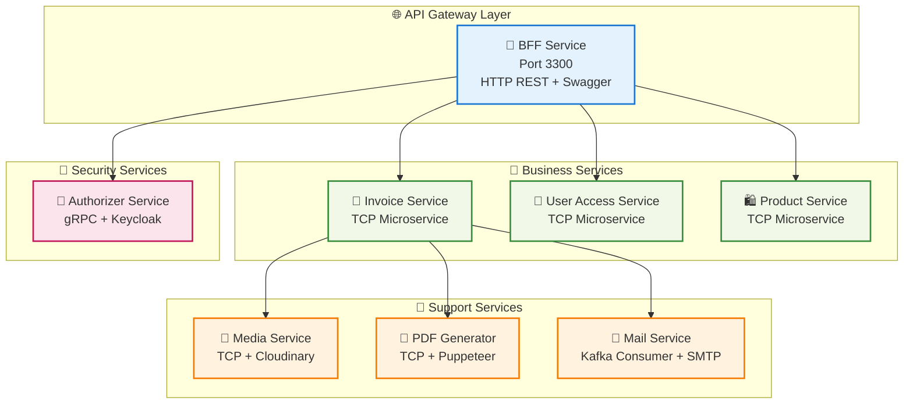
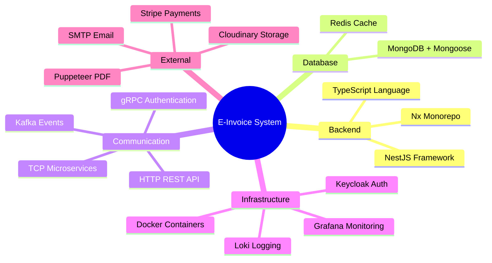

# 📚 Hệ Thống E-Invoice: NestJS Microservices Production-Ready

[](https://www.typescriptlang.org/)
[](https://nestjs.com/)
[](https://www.mongodb.com/)
[](https://kafka.apache.org/)
[](https://www.docker.com/)
[](https://stripe.com/)

Một hệ thống **E-Invoice hoàn chỉnh** được xây dựng theo **Microservices Architecture** với NestJS, bao gồm **8 microservices**, **payment integration**, **centralized logging**, và **production-ready features**.

## 📋 Tài Liệu Hướng Dẫn

| 📄 Tài Liệu | 🎯 Mục Đích | 👥 Đối Tượng | 📊 Độ Chi Tiết |
|-------------|-------------|--------------|----------------|
| **README.md** | Tổng quan & Quick Start | 📖 Tất cả | ⭐⭐⭐ |
| **TEACHING_GUIDE.md** | Chi tiết kỹ thuật & Learning Path | 🎓 Học viên | ⭐⭐⭐⭐⭐ |
| **INSTRUCTOR_SUMMARY.md** | Hướng dẫn giảng dạy & Demo | 👨‍🏫 Giảng viên | ⭐⭐⭐⭐ |

---

## 🏗️ Kiến Trúc Hệ Thống

### 🎯 Tổng Quan
Hệ thống E-Invoice được thiết kế theo **Microservices Architecture** hiện đại với **Nx Monorepo**, bao gồm **8 microservices** độc lập và **6 infrastructure services**:

### 🏢 Application Services (8 Microservices)


### 🏗️ Infrastructure Services (6 Services)
```
📊 Infrastructure Stack
├── 🗄️ MongoDB (Port 27017) - Document Database
├── 📨 Kafka (Port 9092) - Event Streaming Platform  
├── 🔑 Keycloak (Port 8180) - Identity & Access Management
├── 🔴 Redis (Port 6379) - Cache Store & Session Management
├── 📊 Grafana (Port 3000) - Monitoring Dashboard
├── 📋 Loki (Port 3100) - Log Aggregation Server
└── 📡 Promtail - Docker Log Collection Agent
```

### 🔄 Communication Patterns
| Pattern | Usage | Services | Protocol | Performance |
|---------|-------|----------|----------|-------------|
| **HTTP REST** | External API | BFF ↔ Frontend | HTTP/1.1 | Standard |
| **TCP** | Internal Sync | BFF ↔ Services | TCP | High |
| **gRPC** | Authentication | BFF ↔ Authorizer | HTTP/2 | Very High |
| **Events** | Async Processing | Invoice → Mail | Kafka | Scalable |
| **Cache** | Performance | UserGuard ↔ Redis | TCP | Ultra Fast |
| **Webhooks** | External Events | Stripe → Payment | HTTP | Reliable |

---

## 🎯 Cách Sử Dụng

### Cho Giảng Viên 👨‍🏫

1. **Bắt đầu với**: `INSTRUCTOR_SUMMARY.md`
   - Tổng quan nhanh về repo
   - Cấu trúc khóa học đề xuất
   - Cách chạy demo
   - Bài tập thực hành

2. **Tham khảo chi tiết**: `TEACHING_GUIDE.md`
   - Nội dung giảng dạy đầy đủ
   - Code examples với giải thích
   - Sơ đồ Mermaid chi tiết
   - Best practices

### Cho Học Viên 🎓

1. **Tài liệu chính**: `TEACHING_GUIDE.md`
   - Đọc tuần tự từ Phần 1 → Phần 11
   - Thực hành theo bài tập
   - Tham khảo sơ đồ để hiểu flow

---

## 🚀 Quick Start

### 📋 Yêu Cầu Hệ Thống
| Component | Version | Purpose |
|-----------|---------|---------|
| **Node.js** | v18+ | Runtime environment |
| **pnpm** | Latest | Package manager |
| **Docker Desktop** | Latest | Containerization |
| **RAM** | 8GB (16GB recommended) | System resources |
| **Disk** | 20GB free space | Docker images & data |

### ⚡ One-Command Setup
```bash
# 🚀 Complete production deployment
git clone <repo-url> && cd <repo-name>
pnpm install && pnpm build

# 🎯 Access points:
# • API Documentation: http://localhost:3300/api/v1/docs
# • Grafana Dashboard: http://localhost:3000 (admin/admin)
# • Keycloak Admin: http://localhost:8180 (admin/admin)
# • Redis Insight: http://localhost:5540
```

### 🛠️ Development Modes

#### 🏭 Production Mode (Recommended for Demo)
```bash
# Full production environment with all services
pnpm build                    # Build all services + Docker images + Start infrastructure + Deploy
```

#### 🔧 Development Mode
```bash
# Option 1: All services in development
pnpm dev                      # Start all 8 microservices

# Option 2: Core services only (faster startup)
pnpm dev-lite                 # Start: bff, invoice, authorizer, user-access
```

#### 🎯 Infrastructure Only
```bash
# Start only infrastructure services
pnpm docker:start:provider    # MongoDB, Kafka, Keycloak, Redis, Grafana, Loki
```

---

## 🔍 System Highlights

### 🏛️ Architecture Excellence
| Pattern | Implementation | Business Value |
|---------|----------------|----------------|
| **Microservices** | 8 independent services | Scalability & maintainability |
| **API Gateway** | BFF with unified interface | Single entry point |
| **Event-Driven** | Kafka async processing | Loose coupling & resilience |
| **Repository Pattern** | Clean data access layer | Testability & separation |
| **Dependency Injection** | NestJS DI container | Modularity & testing |
| **CQRS Pattern** | Command/Query separation | Performance optimization |

### 💡 Technology Stack


### 🚀 Production-Ready Features

#### 🛡️ Security & Authentication
- ✅ **Keycloak Integration** - Enterprise-grade authentication
- ✅ **JWT Token Management** - Secure token handling
- ✅ **Redis Token Caching** - 95% performance improvement
- ✅ **SHA256 Token Hashing** - Secure cache keys
- ✅ **Webhook Signature Verification** - Stripe security

#### 📊 Monitoring & Observability  
- ✅ **Centralized Logging** - Grafana + Loki + Promtail stack
- ✅ **Real-time Log Streaming** - Live monitoring dashboard
- ✅ **Process ID Tracking** - Request tracing across services
- ✅ **Container Log Aggregation** - Docker log collection
- ✅ **Error Correlation** - Cross-service error tracking

#### 🔧 Development Excellence
- ✅ **Global Exception Handling** - Consistent error responses
- ✅ **Request/Response Logging** - Complete audit trail
- ✅ **DTO Validation** - Input validation with class-validator
- ✅ **Swagger Documentation** - Interactive API documentation
- ✅ **Environment Configuration** - Multi-environment support
- ✅ **Hot Module Replacement** - Fast development feedback

#### 💳 Payment Integration
- ✅ **Stripe Checkout Sessions** - Secure payment processing
- ✅ **Webhook Event Handling** - Real-time payment status
- ✅ **Email Payment Links** - Professional email templates
- ✅ **Invoice Status Management** - Automated workflow

---


## 🛠️ Development Tools & Access Points

### 🌐 Web Interfaces
| Service | URL | Credentials | Purpose |
|---------|-----|-------------|---------|
| **API Documentation** | http://localhost:3300/api/v1/docs | None | Swagger UI for API testing |
| **Grafana Dashboard** | http://localhost:3000 | admin/admin | Monitoring & log visualization |
| **Keycloak Admin** | http://localhost:8180 | admin/admin | Identity management |
| **Redis Insight** | http://localhost:5540 | None | Redis cache visualization |

### 🔧 CLI Tools & APIs
```bash
# Database Access
docker exec -it mongodb mongosh                    # MongoDB shell
docker exec -it redis_server redis-cli            # Redis CLI

# Log Analysis
curl http://localhost:3100/ready                   # Loki health check
curl http://localhost:3100/metrics                 # Loki metrics

# Kafka Management
docker exec -it kafka_server kafka-topics \
  --list --bootstrap-server localhost:9092         # List topics

# Stripe Webhook Testing
stripe listen --forward-to localhost:3300/api/v1/payment/stripe/webhook
```

### 📊 Monitoring & Debugging
```bash
# System Health
docker ps                                          # Running containers
docker network ls | grep einvoice                  # Network status
docker logs <service-name>                         # Service logs

# Performance Monitoring
docker stats                                       # Resource usage
curl http://localhost:3300/api/v1/docs            # API health
```

### 🎨 Diagram Viewing
| Platform | Support | URL |
|----------|---------|-----|
| **GitHub** | Native rendering | Automatic in README |
| **VSCode** | Mermaid Preview extension | Install extension |
| **Online Editor** | Full editor | https://mermaid.live/ |

---

## 🆘 Troubleshooting & Support

### 🔍 Common Issues & Solutions

#### 🐳 Docker Issues
```bash
# Issue: Containers won't start
docker system prune -f                             # Clean Docker system
docker network create einvoice-nw                  # Recreate network

# Issue: Port conflicts
lsof -i :3300                                      # Check port usage
docker ps -a                                       # Check all containers

# Issue: Out of disk space
docker system df                                   # Check disk usage
docker image prune -f                              # Remove unused images
```

#### 🔌 Service Connection Issues
```bash
# Check service health
curl -f http://localhost:3300/api/v1/docs          # BFF health
docker exec -it mongodb mongosh --eval "db.runCommand('ping')"  # MongoDB
docker exec -it kafka_server kafka-broker-api-versions # Kafka
docker exec -it redis_server redis-cli ping        # Redis
```

#### 📊 Monitoring Stack Issues
```bash
# Grafana not accessible
docker logs grafana                                # Check Grafana logs
curl http://localhost:3000                         # Test connection

# Loki not collecting logs
docker logs loki                                   # Check Loki logs
docker logs promtail                               # Check Promtail logs
curl http://localhost:3100/ready                   # Loki health

# Missing logs in Grafana
# 1. Check Promtail is running: docker ps | grep promtail
# 2. Verify log path: docker exec -it promtail ls /var/lib/docker/containers
# 3. Check Grafana data source: http://localhost:3000/datasources
```

### 🚨 Emergency Recovery
```bash
# Complete system reset (⚠️ Will delete all data)
docker-compose -f docker-compose.provider.yaml down -v
docker-compose -f docker-compose.dev.yaml down -v
docker system prune -af
docker volume prune -f
pnpm build                                          # Fresh start
```

### 💬 Getting Help

#### 📚 Documentation Priority
1. **README.md** - Quick setup & troubleshooting
2. **TEACHING_GUIDE.md** - Detailed technical guide  
3. **INSTRUCTOR_SUMMARY.md** - Teaching methodology

#### 🐛 Issue Reporting Template
```markdown
**Environment:**
- OS: [Windows/Mac/Linux]
- Node.js: [version]
- Docker: [version]
- RAM: [available]

**Issue Description:**
[Describe the problem]

**Steps to Reproduce:**
1. [First step]
2. [Second step]
3. [Error occurs]

**Expected vs Actual:**
- Expected: [what should happen]
- Actual: [what actually happens]

**Logs:**
```bash
[Include relevant logs]
```

#### 🤝 Contribution Guidelines
- 🐛 **Bug Reports**: Use the template above
- 💡 **Feature Requests**: Describe use case & business value
- 📖 **Documentation**: Improve clarity & add examples
- 🧪 **Code Contributions**: Follow existing patterns & add tests

---

## 🎯 Next Steps

### 👨‍🏫 For Instructors
1. Read **INSTRUCTOR_SUMMARY.md** for teaching methodology
2. Run the complete demo flow
3. Prepare environment for students
4. Review exercise solutions

### 🎓 For Students  
1. Complete the **Quick Start** setup
2. Follow **TEACHING_GUIDE.md** step by step
3. Practice with provided exercises
4. Build your own features

### 🚀 For Production Use
1. Update environment variables for production
2. Configure proper authentication
3. Set up monitoring alerts
4. Implement backup strategies

---

**Happy Learning & Building! 🎓🚀**

*Tài liệu được cập nhật thường xuyên để phản ánh chính xác source code hiện tại. Mọi góp ý để cải thiện hệ thống và tài liệu đều được hoan nghênh.*
