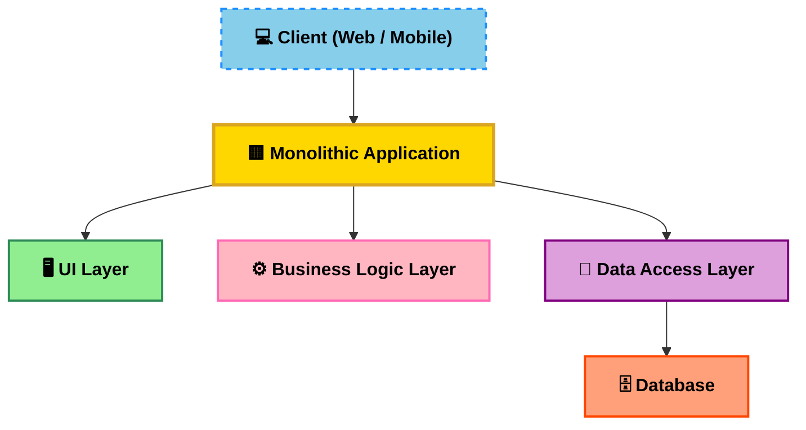
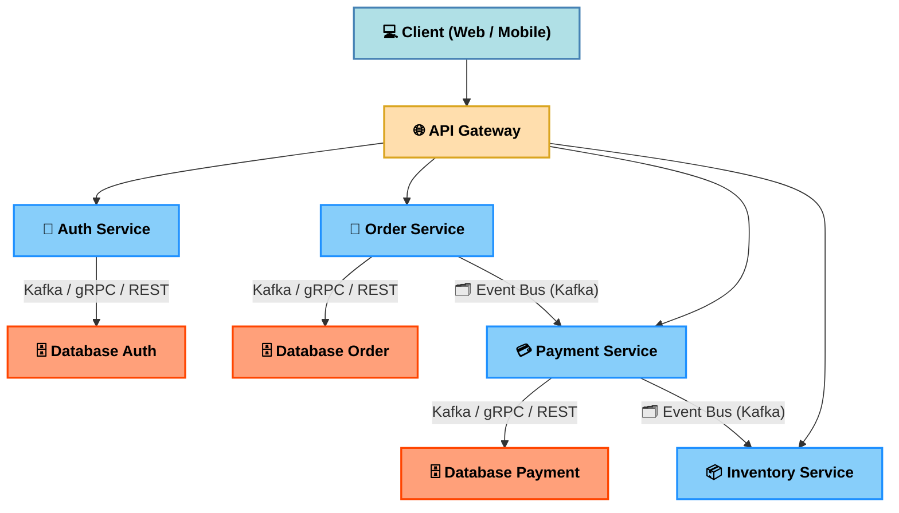

# 📚 Lesson 1: Giới thiệu về Microservice Architecture

## 🎯 Mục tiêu bài học
- Hiểu **Microservice** là gì và tại sao nó được sử dụng.
- Phân biệt **Microservice** với **Monolithic**.
- Nắm cấu trúc tổng quan và các thành phần chính của Microservice.
- Hiểu cách các service giao tiếp với nhau.
- Thấy được ví dụ áp dụng Microservice trong dự án thực tế.

---

## 1. Microservice là gì?

**Microservice** là một kiến trúc phần mềm trong đó hệ thống được chia thành nhiều **dịch vụ nhỏ** (services) độc lập.  
Mỗi service đảm nhận **một chức năng riêng biệt**, có thể phát triển, triển khai và mở rộng độc lập.

🔍 **Đặc điểm chính:**
- **Independence**: Mỗi service có codebase riêng, deploy riêng.
- **Specialization**: Mỗi service chỉ tập trung vào một chức năng.
- **Scalability**: Có thể scale từng service độc lập.
- **Polyglot**: Mỗi service có thể dùng ngôn ngữ & công nghệ khác nhau.

🔍 **Ưu điểm:**

---

## 2. Monolithic là gì?

**Monolithic Architecture** là mô hình kiến trúc phần mềm trong đó **toàn bộ ứng dụng** (gồm frontend, backend, business logic, database access) được gói gọn và triển khai như **một khối duy nhất**.

## Đặc điểm
- Một codebase duy nhất.
- Triển khai dưới dạng **một file** (hoặc container) duy nhất.
- Các module chia sẻ chung tài nguyên và runtime.

## Ưu điểm
- Đơn giản để phát triển và triển khai ban đầu.
- Debug, test nhanh ở giai đoạn nhỏ.
- Dễ quản lý khi team nhỏ.

## Nhược điểm
- Khó mở rộng từng phần.
- Deploy phải build lại toàn bộ hệ thống.
- Dễ bị ảnh hưởng dây chuyền khi lỗi.

## Ví dụ
Ứng dụng e-invoice ban đầu viết toàn bộ API, UI, xử lý PDF, email… trong **một project duy nhất**.

## Sơ đồ kiến trúc Monolithic

## 3. So sánh Monolithic vs Microservice

| Tiêu chí        | Monolithic | Microservice |
|-----------------|------------|--------------|
| Codebase        | 1 codebase duy nhất | Nhiều codebase nhỏ |
| Triển khai      | Deploy tất cả 1 lần | Deploy từng service |
| Scale           | Scale toàn bộ app | Scale từng service |
| Độ phức tạp     | Thấp (ban đầu) | Cao (quản lý service) |
| Rủi ro          | Lỗi 1 phần => sập toàn bộ | Lỗi 1 service => các service khác vẫn chạy |

---

## 4. Cấu trúc tổng quan hệ thống Microservice

---

