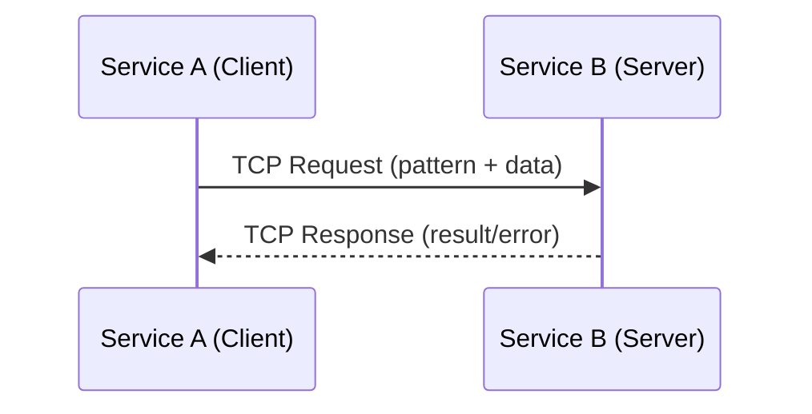

# 📘 Lesson: TCP Transport trong Microservices

## 1. Giới thiệu
Trong kiến trúc microservices, các dịch vụ cần giao tiếp với nhau để xử lý nghiệp vụ. Có nhiều lựa chọn **transport layer**:  
- **HTTP/REST**: dễ triển khai, phổ biến, nhưng có overhead cao.  
- **gRPC**: hiệu năng cao, dựa trên HTTP/2, phù hợp cho strongly-typed API.  
- **Message broker (Kafka, RabbitMQ)**: dùng cho event-driven, bất đồng bộ.  
- **TCP Transport**: cơ chế **socket-based, low-level**, tối ưu cho giao tiếp **nội bộ** giữa các dịch vụ cần hiệu năng cao.  

---

## 2. TCP Transport là gì?

- **TCP (Transmission Control Protocol)**: một giao thức ở tầng **Transport** trong mô hình TCP/IP.  
- Đặc điểm:  
  - **Kết nối hướng phiên (connection-oriented)** → cần thiết lập kết nối trước khi truyền dữ liệu.  
  - **Đảm bảo tin cậy (reliable)** → dữ liệu đến đúng thứ tự, không mất mát.  
  - **Truyền dữ liệu hai chiều (full-duplex)**.  

Trong microservices:  
- Một service có thể **lắng nghe TCP socket**.  
- Service khác **kết nối và gửi request** qua TCP.  
- Giao tiếp thường theo mô hình **Request/Response** (RPC).  

---

## 3. Kiến trúc TCP Communication
Mô hình tổng quát:

- **Client**: gửi dữ liệu qua TCP socket với một “pattern” định danh (ví dụ `cmd: get_user`).  
- **Server**: lắng nghe trên một port, nhận dữ liệu, xử lý và trả về response.  
- Mỗi lần giao tiếp là một **RPC call qua TCP**.  

---

## 4. Khi nào dùng TCP Transport?
✅ **Phù hợp khi**:  
- Các service chạy trong cùng một private network (LAN, Docker network, Kubernetes cluster).  
- Cần giao tiếp nhanh, độ trễ thấp.  
- Cần cơ chế RPC đơn giản, không cần overhead như HTTP/gRPC.  

⚠️ **Không phù hợp khi**:  
- Public API (TCP không có chuẩn tài liệu hóa như HTTP/REST).  
- Hệ thống cần event streaming hoặc xử lý bất đồng bộ → nên dùng Kafka/RabbitMQ.  
- Cần strongly-typed schema → gRPC sẽ tốt hơn.  

---

## 5. Ưu điểm và Hạn chế

### Ưu điểm
- **Hiệu năng cao**: TCP tránh được overhead của HTTP (headers, cookies...).  
- **Reliable**: dữ liệu đảm bảo không mất gói, đúng thứ tự.  
- **Simple RPC model**: dễ dàng gọi hàm từ service này sang service khác.  

### Hạn chế
- **Khó debug**: không có request log dễ đọc như HTTP.  
- **Không có schema chuẩn**: cần tự quản lý contract (pattern + payload).  
- **Không scale tốt bằng message broker**: TCP phù hợp hơn cho cặp client-server hơn là publish/subscribe.  

---

## 6. Best Practices
1. **Tách biệt business logic và transport layer** → không để logic gắn chặt với TCP.  
2. **Đặt convention rõ ràng cho pattern** (vd: `user.get_profile`, `order.create`).  
3. **Timeout & Retry** khi gọi RPC để tránh treo request.  
4. **Error Handling chuẩn hóa** → luôn trả về `{ success, data, error }`.  
5. **Bảo mật**: chỉ dùng TCP trong private network hoặc qua VPN, không expose trực tiếp ra internet.  
6. **Service Discovery**: khi nhiều instance, cần cơ chế load balancing hoặc DNS-based discovery.  
