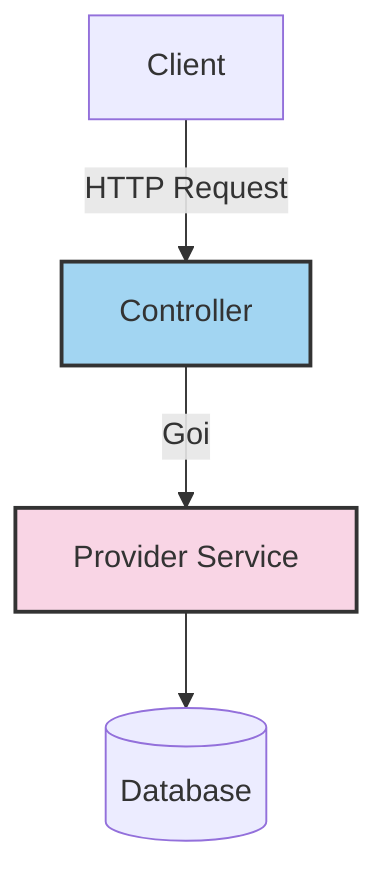

# Giới thiệu tổng quan về NestJS


## 1. NestJS là gì?

- NestJS là một framework Node.js được xây dựng trên nền tảng TypeScript, hỗ trợ phát triển ứng dụng server-side với kiến trúc module hóa.  
- Nó tận dụng sức mạnh của ES6+, cung cấp Dependency Injection (DI), decorator, và một hệ sinh thái phong phú.  
- NestJS được thiết kế để xây dựng các ứng dụng có quy mô từ nhỏ đến lớn, đặc biệt là các hệ thống microservices.

### Ví dụ: Câu lệnh tạo project NestJS

```bash
npm i -g @nestjs/cli
nest new project-name
```

## 2. Tại sao nên dùng NestJS?

- **TypeScript sẵn có:** giúp code rõ ràng, dễ bảo trì, ít lỗi runtime.  
- **Kiến trúc module hóa:** giúp tổ chức code tốt, dễ mở rộng.  
- **Hệ thống Dependency Injection mạnh mẽ:** giúp quản lý các service và logic phức tạp dễ dàng hơn.  
- **Tích hợp sẵn nhiều tính năng:** như validation, pipes, guards, interceptors.  
- **Hỗ trợ nhiều loại giao tiếp:** REST, GraphQL, WebSocket, Microservices…  
- **Cộng đồng và tài liệu phát triển mạnh:** giúp học tập và phát triển dễ dàng.

---

## 3. Kiến trúc cơ bản của NestJS

NestJS tổ chức ứng dụng theo mô hình **Module - Controller - Provider (Service)**:

- **Module:** Đóng gói các thành phần có liên quan lại với nhau.  
- **Controller:** Xử lý các request HTTP, nhận và trả về response.  
- **Provider (Service):** Xử lý logic nghiệp vụ, thao tác dữ liệu, gọi các API khác.

### Diagram kiến trúc NestJS:



## 4. Ví dụ đơn giản với NestJS

Tạo một Controller trả về "Hello World":

```typescript
import { Controller, Get } from '@nestjs/common';

@Controller()
export class AppController {
  @Get()
  getHello(): string {
    return 'Hello World!';
  }
}
```
## 5. Các thành phần quan trọng khác

- **Middleware:** Xử lý logic trước khi request tới controller.  
- **Pipe:** Xử lý và validate dữ liệu đầu vào.  
- **Guard:** Kiểm tra quyền truy cập (authentication, authorization).  
- **Interceptor:** Can thiệp vào quá trình request/response, ví dụ logging hoặc transform dữ liệu.

---

## Kết luận

NestJS là framework rất mạnh mẽ và tiện lợi cho phát triển backend hiện đại với Node.js.  
Với kiến trúc rõ ràng, tận dụng TypeScript và nhiều tính năng tích hợp, NestJS giúp bạn xây dựng các ứng dụng dễ bảo trì và mở rộng.  
Hãy bắt đầu làm quen với NestJS để nâng cao kỹ năng phát triển backend nhé!  

Cảm ơn các bạn đã theo dõi!  
Đừng quên like và subscribe để nhận thêm nhiều kiến thức bổ ích về backend development với NestJS.

