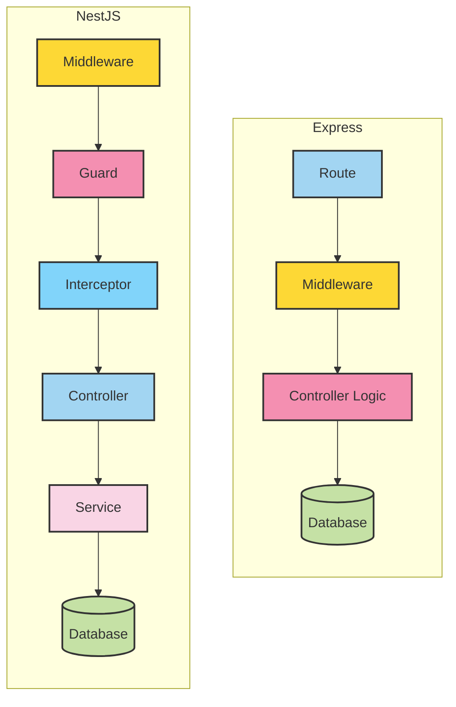

# So sánh NestJS và Express

## 1. Giới thiệu

NestJS và Express đều là framework backend cho Node.js, nhưng:

- **Express**: nhẹ, tối giản, "unopinionated" (không ép buộc cấu trúc), phổ biến nhất trong Node.js ecosystem.
- **NestJS**: xây dựng trên Express (hoặc Fastify), opinionated (đưa ra quy tắc và cấu trúc rõ ràng), hướng TypeScript và kiến trúc module.

---

## 2. So sánh tổng quan

| Tiêu chí             | Express                            | NestJS                                     |
| -------------------- | ---------------------------------- | ------------------------------------------ |
| **Cấu trúc**         | Tùy lập trình viên tự tổ chức      | Kiến trúc module rõ ràng                   |
| **Ngôn ngữ**         | JS/TS (TypeScript hỗ trợ thủ công) | TypeScript mặc định                        |
| **Học tập**          | Nhanh cho dự án nhỏ                | Ban đầu tốn thời gian hơn                  |
| **Khả năng mở rộng** | Thủ công, cần nhiều setup          | Có sẵn DI, module hóa, dễ mở rộng          |
| **Tích hợp sẵn**     | Không                              | Nhiều tính năng built-in (DI, Pipe, Guard) |
| **Kiểu kiến trúc**   | Tự do (có thể hỗ trợ MVC, REST)    | Module + Dependency Injection + Decorator  |
| **Microservices**    | Cần tự build                       | Built-in support                           |
| **Testing**          | Cần setup nhiều                    | Built-in support với Jest                  |
| **Cộng đồng**        | Rất lớn                            | Đang phát triển nhanh                      |

---

## 3. So sánh chi tiết

### 3.1. Cấu trúc dự án

- **Express**: Không áp đặt cấu trúc thư mục, ví dụ:
  ```
  project/
    app.js
    routes/
    controllers/
    models/
  ```
- **NestJS**: Module hóa, mỗi module chứa controller + service riêng:
  ```
  src/
    app.module.ts
    users/
      users.module.ts
      users.controller.ts
      users.service.ts
  ```

---

### 3.2. Dependency Injection

- **Express**: Không có DI built-in, phải tự implement hoặc dùng thư viện ngoài.
- **NestJS**: DI là core, giúp quản lý dependency rõ ràng, dễ test.

---

### 3.3. TypeScript

- **Express**: Cần cấu hình thủ công nếu muốn dùng TypeScript.
- **NestJS**: Hỗ trợ TypeScript mặc định, có sẵn type hint đầy đủ.

---

### 3.4. Middleware & Decorator

- **Express**: Middleware dạng function `(req, res, next)`.
- **NestJS**: Vẫn dùng middleware được, nhưng chủ yếu dùng **Decorator** (`@Get()`, `@Post()`, `@Injectable()`).

---

### 3.5. Khả năng mở rộng & Tích hợp

- **Express**: Phù hợp app nhỏ & trung bình. Muốn microservices, GraphQL, WebSocket → phải setup thủ công.
- **NestJS**: Hỗ trợ microservices, GraphQL, WebSocket, gRPC, Kafka... chỉ cần enable module.

---

### 3.6. Testing

- **Express**: Cần chọn framework test + setup.
- **NestJS**: Tích hợp sẵn Jest, có thể test unit & e2e dễ dàng.

---

## 4. Ví dụ minh họa

**Express**

```javascript
const express = require('express');
const app = express();

app.get('/', (req, res) => {
  res.send('Hello Express');
});

app.listen(3000, () => console.log('Server running'));
```

**NestJS**

```javascript
import { Controller, Get } from '@nestjs/common';
import { NestFactory } from '@nestjs/core';
import { Module } from '@nestjs/common';

@Controller()
class AppController {
  @Get()
  getHello() {
    return 'Hello NestJS';
  }
}

@Module({
  controllers: [AppController],
})
class AppModule {}

async function bootstrap() {
  const app = await NestFactory.create(AppModule);
  await app.listen(3000);
}
bootstrap();
```

## Architecture Diagram


