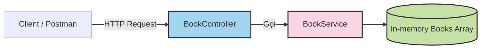

# 🚀 Lesson: Xây dựng CRUD đơn giản với NestJS

## 🎯 Mục tiêu bài học
Sau bài học này, học viên sẽ:
- Hiểu **cấu trúc dự án NestJS**.
- Nắm được **các thành phần cơ bản**: Module, Controller, Service.
- Biết cách tạo **API CRUD**.
- Chạy thử và test API bằng Postman.

---

## 1️⃣ Tạo dự án NestJS mới
```bash
npm i -g @nestjs/cli
nest new book-crud
```
- Chọn npm hoặc yarn khi được hỏi.
- Sau khi cài xong, mở dự án trong VSCode.
  
## 2️⃣ Hiểu cấu trúc dự án NestJS

```text
src/
├── app.controller.ts      # Controller gốc
├── app.service.ts         # Service gốc
├── app.module.ts          # Root Module
├── main.ts                # File khởi chạy
```
📌 NestJS chia logic thành Module (quản lý nhóm chức năng), mỗi module có Controller (nhận request) và Service (xử lý logic).

## 3️⃣ Tạo Module, Controller và Service cho Book

```text
nest g module book
nest g controller book
nest g service book
```

Kết quả:
```text
src/book/
├── book.controller.ts
├── book.service.ts
├── book.module.ts
```

## 4️⃣ Viết CRUD trong Service (book.service.ts)
```typescript
import { Injectable } from '@nestjs/common';

export interface Book {
  id: number;
  title: string;
  author: string;
}

@Injectable()
export class BookService {
  private books: Book[] = [];
  private idCounter = 1;

  findAll(): Book[] {
    return this.books;
  }

  findOne(id: number): Book {
    return this.books.find(book => book.id === id);
  }

  create(book: Omit<Book, 'id'>): Book {
    const newBook = { id: this.idCounter++, ...book };
    this.books.push(newBook);
    return newBook;
  }

  update(id: number, updateData: Partial<Book>): Book {
    const book = this.findOne(id);
    if (book) {
      Object.assign(book, updateData);
    }
    return book;
  }

  remove(id: number): boolean {
    const index = this.books.findIndex(book => book.id === id);
    if (index >= 0) {
      this.books.splice(index, 1);
      return true;
    }
    return false;
  }
}
```
## 5️⃣ Viết Controller (book.controller.ts)
```typescript
import { Controller, Get, Post, Put, Delete, Body, Param } from '@nestjs/common';
import { BookService, Book } from './book.service';

@Controller('books')
export class BookController {
  constructor(private readonly bookService: BookService) {}

  @Get()
  getAll(): Book[] {
    return this.bookService.findAll();
  }

  @Get(':id')
  getOne(@Param('id') id: string): Book {
    return this.bookService.findOne(Number(id));
  }

  @Post()
  create(@Body() book: Omit<Book, 'id'>): Book {
    return this.bookService.create(book);
  }

  @Put(':id')
  update(@Param('id') id: string, @Body() book: Partial<Book>): Book {
    return this.bookService.update(Number(id), book);
  }

  @Delete(':id')
  remove(@Param('id') id: string): { deleted: boolean } {
    return { deleted: this.bookService.remove(Number(id)) };
  }
}
```
## 6️⃣ Kết nối Module (book.module.ts)
```typescript
import { Module } from '@nestjs/common';
import { BookController } from './book.controller';
import { BookService } from './book.service';

@Module({
  controllers: [BookController],
  providers: [BookService],
})
export class BookModule {}
```
Thêm vào app.module.ts:
```typescript
import { Module } from '@nestjs/common';
import { BookModule } from './book/book.module';

@Module({
  imports: [BookModule],
})
export class AppModule {}
```
## 7️⃣ Chạy thử ứng dụng

```bash
npm run start:dev
```

Mở Postman hoặc cURL để test:

- GET http://localhost:3000/books → Lấy tất cả

- POST http://localhost:3000/books → Tạo sách mới

- GET http://localhost:3000/books/1 → Lấy chi tiết

- PUT http://localhost:3000/books/1 → Cập nhật sách

- DELETE http://localhost:3000/books/1 → Xóa sách

## 8️⃣ Luồng xử lý (Diagram)


  
